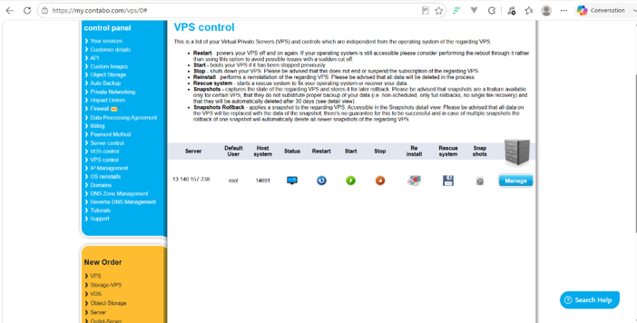
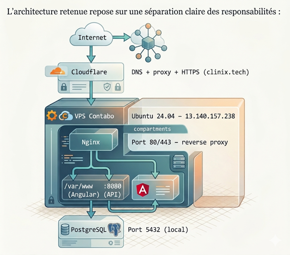
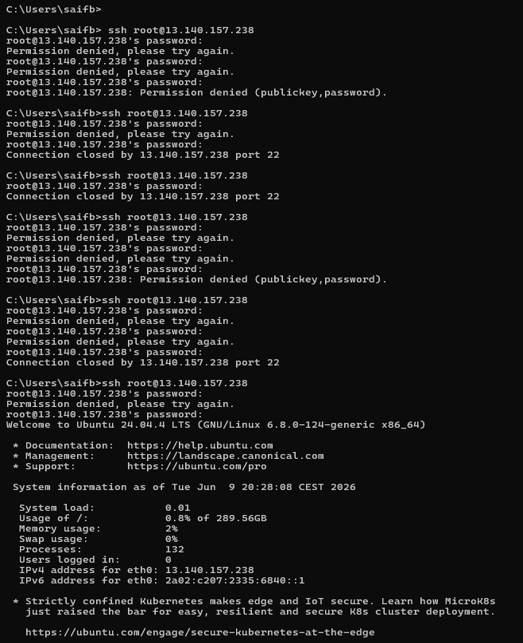
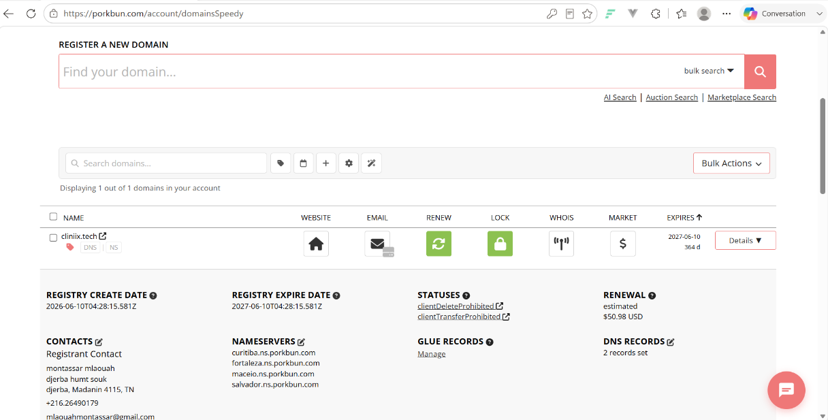

# Chapitre X — Hébergement et déploiement de l'application Clinix sur Contabo

## X.1 Introduction

Après le développement de la plateforme **Clinix** (backend Spring Boot, frontend Angular et base de données PostgreSQL), il était nécessaire de rendre l'application accessible en ligne afin de permettre son utilisation réelle par les utilisateurs finaux. Ce chapitre présente le processus complet d'hébergement de la solution sur un serveur privé virtuel (VPS) fourni par **Contabo**, ainsi que la configuration du nom de domaine **cliniix.tech** via le registrar **Porkbun** ([porkbun.com](https://porkbun.com)).

L'objectif de ce déploiement est triple :

- rendre l'application accessible depuis Internet via une adresse stable ;
- garantir la disponibilité du backend et du frontend ;
- sécuriser l'accès grâce à un nom de domaine et au protocole HTTPS.

Le choix a été fait d'un déploiement **sans Docker**, en installant directement les services sur le serveur (Java, PostgreSQL, Nginx), ce qui offre un contrôle fin sur l'environnement de production et facilite le débogage en cas d'incident.

---

## X.2 Choix de l'infrastructure

### X.2.1 Hébergeur : Contabo

**Contabo** a été retenu comme fournisseur d'hébergement pour les raisons suivantes :

| Critère | Justification |
|---------|---------------|
| **Coût** | Offre VPS abordable adaptée à un projet académique (PFE) |
| **Ressources** | CPU, RAM et SSD suffisants pour Spring Boot + Angular + PostgreSQL |
| **Localisation** | Datacenters en Europe, latence acceptable pour la Tunisie |
| **Flexibilité** | Accès root SSH complet, installation libre des composants |

**Configuration du VPS retenue :**

| Paramètre | Valeur |
|-----------|--------|
| Offre | Cloud VPS 10 SSD |
| Système d'exploitation | Ubuntu 24.04 LTS |
| Adresse IP publique | `13.140.157.238` |
| Hostname | `vmi3356840` |
| Accès | SSH (`root@13.140.157.238`) |

> **Figure X.1 — Panneau de contrôle VPS Contabo (Customer Control Panel)**
>
> 
>
> *Interface de gestion Contabo affichant le serveur virtuel actif (IP 13.140.157.238, utilisateur root) avec les options de contrôle : redémarrage, démarrage, arrêt, réinstallation et snapshots.*

---

### X.2.2 Registrar de domaine : Porkbun

Le nom de domaine **cliniix.tech** a été acquis auprès de **[Porkbun](https://porkbun.com)**, un registrar américain reconnu pour :

| Critère | Justification |
|---------|---------------|
| **Prix** | Tarifs compétitifs pour les extensions `.tech` |
| **DNS intégré** | Gestion des enregistrements DNS incluse sans service tiers |
| **Interface** | Panneau de gestion simple (`domainsSpeedy`) |
| **Sécurité** | Verrouillage du domaine contre transfert et suppression accidentelle |

---

### X.2.3 Architecture de déploiement

L'architecture retenue repose sur une séparation claire des responsabilités :

> **Figure X.2.3 — Schéma d'architecture de déploiement de l'application Clinix**
>
> 
>
> *Schéma illustrant le flux des requêtes : Internet → DNS Porkbun (cliniix.tech) → VPS Contabo (Ubuntu 24.04) → Nginx (reverse proxy) → Frontend Angular (/var/www) et API Spring Boot (port 8080) → PostgreSQL (port 5432).*

**Répartition des composants :**

| Composant | Technologie | Emplacement / Port |
|-----------|-------------|-------------------|
| Frontend (SPA) | Angular 19 (build statique) | `/var/www/clinix` — servi par Nginx (port 80) |
| Backend (API REST) | Spring Boot 3.5 / Java 17 | `/opt/clinix/backend` — port `8080` (local) |
| Base de données | PostgreSQL 16 | Base `PFE2`, utilisateur `clinix` — port `5432` |
| Reverse proxy | Nginx 1.24 | Proxy `/api/` et `/auth/` vers le backend |
| Nom de domaine | cliniix.tech | Enregistré et géré sur Porkbun (DNS) |

---

## X.3 Préparation et accès au serveur

### X.3.1 Connexion SSH

La première étape consiste à se connecter au serveur via le protocole SSH :

```bash
ssh root@13.140.157.238
```

> **Figure X.2 — Connexion SSH réussie au VPS Contabo**
>
> 
>
> *Terminal Windows (PowerShell) affichant la connexion SSH réussie au serveur Ubuntu 24.04 LTS (root@13.140.157.238), avec les informations système : charge CPU, utilisation disque (0,8 %), mémoire (2 %) et adresse IP publique.*

### X.3.2 Accès au terminal quand SSH ne fonctionne pas

Si la commande `ssh root@13.140.157.238` affiche **« Connection closed »** ou **« Permission denied »**, l'application Clinix peut rester en ligne (`/api/health` → UP) alors que l'accès terminal est bloqué. Trois solutions complémentaires sont disponibles.

#### Solution A — Console VNC Contabo (accès terminal sans SSH)

Méthode la plus fiable lorsque SSH est indisponible depuis le PC :

1. Ouvrir **[my.contabo.com](https://my.contabo.com)** → **VPS** → serveur `vmi3356840` (`13.140.157.238`)
2. Cliquer sur **VNC** ou **Console** (terminal graphique dans le navigateur)
3. Se connecter :
   - Utilisateur : `root`
   - Mot de passe : celui affiché dans le panneau Contabo (**Reset root password** si oublié)
4. Un terminal Ubuntu s'ouvre : toutes les commandes du chapitre (apt, systemctl, nano, etc.) fonctionnent comme en SSH

> **[Figure X.2b — Capture d'écran : Panneau Contabo — bouton VNC / Console ouvert avec terminal Ubuntu]**

#### Solution B — Réinitialiser le mot de passe root (panneau Contabo)

1. Panneau Contabo → VPS → **Manage** → **Reset root password**
2. Attendre 2 à 5 minutes, redémarrer le VPS si demandé
3. Réessayer depuis Windows PowerShell :

```powershell
ssh root@13.140.157.238
```

Diagnostic détaillé en cas d'échec :

```powershell
ssh -vvv root@13.140.157.238
```

| Message dans les logs | Signification | Action |
|----------------------|---------------|--------|
| `Permission denied` | Mauvais mot de passe | Reset password Contabo |
| `Authentication succeeded` puis `Connection closed` | Problème shell / `.bashrc` | Solution C via VNC |
| `Connection refused` | Service SSH arrêté | VNC → `systemctl start ssh` |

#### Solution C — Configurer l'accès SSH permanent (clé + réparation)

**Étape 1 — Sur le PC Windows** (générer une clé SSH) :

```powershell
cd d:\pfe\backend\scripts
powershell -ExecutionPolicy Bypass -File generer-cle-ssh-windows.ps1
```

Copier la **clé publique** affichée (ligne commençant par `ssh-ed25519`).

**Étape 2 — Dans la console VNC Contabo** (réparer SSH et autoriser la clé) :

```bash
cd /opt/clinix/backend
git pull
bash scripts/configurer-acces-ssh-vnc.sh "COLLER_ICI_LA_CLE_PUBLIQUE"
```

Le script :
- réactive `PasswordAuthentication` et `PermitRootLogin`
- supprime un `exit 0` parasite dans `.bashrc`
- ajoute la clé publique dans `/root/.ssh/authorized_keys`
- débloque fail2ban et redémarre SSH

**Étape 3 — Depuis le PC** (connexion sans mot de passe) :

```powershell
ssh -i "$env:USERPROFILE\.ssh\id_ed25519_clinix" root@13.140.157.238
```

#### Solution D — Gérer l'application sans terminal (depuis le PC)

Si le terminal serveur n'est pas encore accessible, certaines opérations restent possibles depuis Windows :

```powershell
cd d:\pfe\backend\scripts
powershell -File gerer-admin-depuis-pc.ps1
```

Ce script appelle l'API `http://www.cliniix.tech` (login Super Admin, liste admins, création admin). L'activation SMS complète nécessite toutefois un accès terminal (Solution A ou C).

### X.3.3 Mise à jour du système et pare-feu

```bash
apt update && apt upgrade -y
ufw allow 22
ufw allow 80
ufw allow 443
ufw enable
```

> **[Figure X.3 — Capture d'écran : Terminal — commande `ufw status` montrant les ports 22, 80 et 443 ouverts]**

---

## X.4 Installation des dépendances

Les composants suivants ont été installés sur le VPS :

```bash
# Java 17 (runtime Spring Boot)
apt install -y openjdk-17-jdk

# PostgreSQL (base de données)
apt install -y postgresql postgresql-contrib

# Nginx (serveur web + reverse proxy)
apt install -y nginx

# Node.js et npm (compilation du frontend Angular)
apt install -y nodejs npm

# Outils complémentaires
apt install -y git maven curl
```

Vérification des versions installées :

```bash
java -version
psql --version
nginx -v
node -v
npm -v
```

> **[Figure X.4 — Capture d'écran : Terminal — sortie des commandes de vérification des versions (Java 17, PostgreSQL, Nginx, Node.js)]**

---

## X.5 Configuration de la base de données PostgreSQL

### X.5.1 Création de la base et de l'utilisateur

```bash
sudo -u postgres psql <<'EOF'
CREATE USER clinix WITH PASSWORD 'Clinix2026Secure!';
CREATE DATABASE "PFE2" OWNER clinix;
GRANT ALL PRIVILEGES ON DATABASE "PFE2" TO clinix;
\c PFE2
GRANT ALL ON SCHEMA public TO clinix;
EOF
```

### X.5.2 Test de connexion

```bash
PGPASSWORD='Clinix2026Secure!' psql -h localhost -U clinix -d PFE2 -c "SELECT 1;"
```

> **[Figure X.5 — Capture d'écran : Terminal — test de connexion PostgreSQL réussi (`SELECT 1`)]**

---

## X.6 Déploiement du backend Spring Boot

### X.6.1 Récupération et compilation du projet

Le code source a été récupéré depuis le dépôt GitHub du projet :

```bash
mkdir -p /opt/clinix
cd /opt/clinix
git clone https://github.com/montassarmlaouah/clinix.git .
cd backend
```

Fichier de configuration production `application-prod.properties` :

```properties
spring.datasource.url=jdbc:postgresql://localhost:5432/PFE2?sslmode=disable
spring.datasource.username=clinix
spring.datasource.password=Clinix2026Secure!
server.port=8080
jwt.secret=ClinixJwtSecretKey2026Minimum32CharactersLong
app.billing.success-url=https://www.cliniix.tech/mon-abonnement?checkout=success
app.billing.cancel-url=https://www.cliniix.tech/mon-abonnement?checkout=cancel
# Meme reglage que en local (PC) pour que les SMS admin partent
tunisiesms.enabled=true
tunisiesms.api.url=https://mystudents.tunisiesms.tn/api/sms
tunisiesms.dlr.url=https://mystudents.tunisiesms.tn/api/dlr
tunisiesms.api.key=VOTRE_CLE_TUNISIESMS
tunisiesms.sender=TunSMS Test
tunisiesms.api.type=55
spring.flyway.enabled=false
```

Compilation du JAR :

```bash
./mvnw -DskipTests package
```

> **[Figure X.6 — Capture d'écran : Terminal — compilation Maven `BUILD SUCCESS` et génération du JAR]**

### X.6.2 Démarrage et service systemd

```bash
systemctl enable clinix-backend
systemctl start clinix-backend
curl http://localhost:8080/api/health
```

Réponse attendue :

```json
{"status":"UP","service":"Clinux backend"}
```

> **[Figure X.7 — Capture d'écran : Terminal — `curl http://localhost:8080/api/health` retournant `{"status":"UP"}`]**
>
> **[Figure X.8 — Capture d'écran : Terminal — `systemctl status clinix-backend` montrant le service actif (active running)]**

### X.6.3 Initialisation des comptes administrateur

Au premier démarrage, le composant `DataInitializer` crée automatiquement deux comptes Super Admin :

| Utilisateur | Mot de passe |
|-------------|--------------|
| `super.admin` | `Password123!` |
| `super.admin2` | `Password123!` |

> **[Figure X.9 — Capture d'écran : Terminal — logs Spring Boot montrant « Super Admin 1 créé avec succès » et « Started PFEApplication »]**

---

## X.7 Déploiement du frontend Angular

### X.7.1 Compilation en mode production

```bash
cd /opt/clinix/Frontend
npm ci
npm run build
```

Le build Angular génère les fichiers statiques dans :

```
/opt/clinix/Frontend/dist/pfe/browser/
```

> **[Figure X.10 — Capture d'écran : Terminal — `npm run build` terminé avec succès, chemin `dist/pfe/browser`]**

### X.7.2 Copie vers le répertoire web Nginx

```bash
mkdir -p /var/www/clinix
cp -r /opt/clinix/Frontend/dist/pfe/browser/* /var/www/clinix/
chown -R www-data:www-data /var/www/clinix
chmod -R 755 /var/www/clinix
ls -la /var/www/clinix/index.html
```

> **[Figure X.11 — Capture d'écran : Terminal — `ls -la /var/www/clinix/index.html` confirmant le déploiement du frontend]**

### X.7.3 Mise à jour du code (après modifications sur le PC)

Lorsque le code est modifié en local (`d:\pfe`), il faut d'abord le **pousser sur GitHub**, puis **mettre à jour le serveur**.

#### Méthode 1 — Depuis le PC Windows (SSH fonctionnel)

```powershell
cd d:\pfe\backend\scripts
powershell -ExecutionPolicy Bypass -File pousser-et-deployer-depuis-pc.ps1
```

Ce script : commit → push GitHub → `git pull` sur le serveur → compile backend + frontend → redémarre les services.

#### Méthode 2 — Depuis le terminal serveur (VNC ou SSH)

**Étape A — Sur le PC** : pousser le code vers GitHub :

```powershell
cd d:\pfe
git add -A
git commit -m "Mise a jour pour le serveur"
git push origin main
```

**Étape B — Sur le serveur** (coller dans VNC ou SSH) :

```bash
cd /opt/clinix
git pull origin main
chmod +x backend/scripts/mise-a-jour-serveur.sh
bash backend/scripts/mise-a-jour-serveur.sh
```

Le script `mise-a-jour-serveur.sh` exécute automatiquement :

| Étape | Action |
|-------|--------|
| 1 | `git pull` — récupère le dernier code |
| 2 | `./mvnw package` — compile le backend (JAR) |
| 3 | `npm run build` — compile le frontend Angular |
| 4 | Copie vers `/var/www/clinix` |
| 5 | `systemctl restart clinix-backend` |
| 6 | `nginx -t && systemctl reload nginx` |
| 7 | Vérifie `http://localhost:8080/api/health` |

#### Méthode 3 — Mise à jour manuelle (si le script n'existe pas encore)

```bash
cd /opt/clinix && git pull origin main
cd backend && ./mvnw -DskipTests package
cd ../Frontend && npm ci && npm run build
cp -r dist/pfe/browser/* /var/www/clinix/
systemctl restart clinix-backend
systemctl reload nginx
curl http://localhost:8080/api/health
```

> **Important :** si `git pull` ne récupère pas les nouveaux fichiers, vérifiez que `git push` a bien été fait depuis le PC avant la mise à jour serveur.

---

## X.8 Configuration de Nginx (reverse proxy)

Nginx assure deux rôles : servir les fichiers statiques Angular et rediriger les requêtes API vers le backend Spring Boot.

Fichier `/etc/nginx/sites-available/clinix` :

```nginx
server {
    listen 80 default_server;
    listen [::]:80 default_server;
    server_name 13.140.157.238 cliniix.tech www.cliniix.tech;

    root /var/www/clinix;
    index index.html;
    client_max_body_size 50M;

    # API REST Spring Boot
    location /api/ {
        proxy_pass http://127.0.0.1:8080/api/;
        proxy_http_version 1.1;
        proxy_set_header Host $host;
        proxy_set_header X-Real-IP $remote_addr;
        proxy_set_header X-Forwarded-For $proxy_add_x_forwarded_for;
        proxy_set_header X-Forwarded-Proto $scheme;
        proxy_read_timeout 300s;
    }

    # Authentification (login, mot de passe oublié, etc.)
    location /auth/ {
        proxy_pass http://127.0.0.1:8080/auth/;
        proxy_http_version 1.1;
        proxy_set_header Host $host;
        proxy_set_header X-Real-IP $remote_addr;
        proxy_set_header X-Forwarded-For $proxy_add_x_forwarded_for;
        proxy_set_header X-Forwarded-Proto $scheme;
        proxy_read_timeout 300s;
    }

    # Application Angular (SPA)
    location / {
        try_files $uri $uri/ /index.html;
    }
}
```

Activation du site :

```bash
ln -sf /etc/nginx/sites-available/clinix /etc/nginx/sites-enabled/clinix
rm -f /etc/nginx/sites-enabled/default
nginx -t
systemctl reload nginx
```

> **[Figure X.12 — Capture d'écran : Terminal — `nginx -t` avec « syntax is ok » et `curl -I http://localhost` retournant HTTP 200]**

---

## X.9 Configuration du nom de domaine

### X.9.1 Acquisition du domaine sur Porkbun

Le nom de domaine **cliniix.tech** a été enregistré auprès du registrar **[Porkbun](https://porkbun.com)**, choisi pour sa simplicité d'interface, ses tarifs compétitifs et la gestion DNS intégrée sans frais supplémentaires.

**Informations du domaine :**

| Paramètre | Valeur |
|-----------|--------|
| Domaine | `cliniix.tech` |
| Registrar | Porkbun (porkbun.com) |
| Date d'enregistrement | 10 juin 2026 |
| Date d'expiration | 10 juin 2027 |
| Titulaire | montassar mlaouah |
| Statut | Verrouillé (`clientDeleteProhibited`, `clientTransferProhibited`) |
| Coût de renouvellement estimé | 50,98 USD |

> **[Figure X.13 — Capture d'écran : Porkbun — panneau de gestion du domaine cliniix.tech (domainsSpeedy)]**
>
> 
>
> *Capture du tableau de bord Porkbun montrant le domaine actif, la date d'expiration (10/06/2027) et les icônes de gestion (DNS, verrouillage, renouvellement).*

### X.9.2 Nameservers Porkbun

La zone DNS est gérée directement par les nameservers par défaut de Porkbun :

| Nameserver |
|------------|
| `curitiba.ns.porkbun.com` |
| `fortaleza.ns.porkbun.com` |
| `maceio.ns.porkbun.com` |
| `salvador.ns.porkbun.com` |

Ces serveurs assurent la résolution du nom de domaine vers l'adresse IP du VPS Contabo. La propagation DNS prend généralement entre quelques minutes et 24 heures après la configuration des enregistrements.

> **[Figure X.14 — Capture d'écran : Porkbun — section Nameservers du domaine cliniix.tech]**

### X.9.3 Enregistrements DNS

Deux enregistrements DNS ont été configurés dans l'interface Porkbun pour pointer le domaine vers le VPS :

| Type | Host | Answer / Content |
|------|------|------------------|
| A | `www` | `13.140.157.238` |
| A | `@` | `13.140.157.238` |

Cette configuration permet d'accéder à l'application via :

- `http://www.cliniix.tech` (URL principale de production)
- `http://cliniix.tech` (redirection vers le sous-domaine www ou accès direct)

Vérification de la résolution DNS :

```bash
nslookup www.cliniix.tech
# Réponse attendue : 13.140.157.238
```

> **[Figure X.15 — Capture d'écran : Porkbun — page DNS Records avec les 2 enregistrements A configurés]**

### X.9.4 Configuration SSL/TLS (option avancée)

En phase initiale, l'application est accessible en **HTTP** sur le port 80 via Nginx. Pour activer le protocole **HTTPS** en production, il est recommandé d'installer **Certbot** sur le VPS afin d'obtenir un certificat gratuit Let's Encrypt :

```bash
apt install -y certbot python3-certbot-nginx
certbot --nginx -d cliniix.tech -d www.cliniix.tech
```

Après l'installation du certificat, l'application sera accessible de manière sécurisée à l'adresse **https://www.cliniix.tech/login**.

> **[Figure X.16 — Capture d'écran : Navigateur — cadenas HTTPS actif sur https://www.cliniix.tech (après Certbot)]**

---

## X.10 Tests et validation du déploiement

### X.10.1 Tests techniques (terminal)

```bash
# Backend
curl http://localhost:8080/api/health

# Frontend via Nginx
curl -I http://localhost

# API via proxy Nginx
curl http://localhost/api/health

# Authentification
curl -X POST http://localhost/auth/login \
  -H "Content-Type: application/json" \
  -d '{"username":"super.admin","password":"Password123!"}'
```

> **[Figure X.17 — Capture d'écran : Terminal — tests curl réussis (health, login avec token JWT)]**

### X.10.2 Tests fonctionnels (navigateur)

| Test | URL | Résultat attendu |
|------|-----|------------------|
| Accès par IP | `http://13.140.157.238` | Page de connexion Clinix |
| Accès par domaine | `http://www.cliniix.tech/login` | Page de connexion « Portail Médical » |
| Connexion Super Admin | `super.admin` / `Password123!` | Redirection vers le tableau de bord |
| API santé | `http://www.cliniix.tech/api/health` | `{"status":"UP"}` |

> **[Figure X.18 — Capture d'écran : Navigateur — page de connexion Clinix sur http://www.cliniix.tech/login]**
>
> **[Figure X.19 — Capture d'écran : Navigateur — tableau de bord Super Admin après connexion réussie]**
>
> **[Figure X.20 — Capture d'écran : Navigateur — barre d'adresse montrant le cadenas HTTPS (connexion sécurisée)]**

---

## X.11 Difficultés rencontrées et solutions

| Problème | Cause | Solution appliquée |
|----------|-------|-------------------|
| Backend ne démarre pas (`Exit 1`) | Migration Flyway sur base vide | `spring.flyway.enabled=false` dans `application-prod.properties` |
| Page « Welcome to nginx! » | Site par défaut Nginx actif, frontend non déployé | Suppression de `default`, déploiement dans `/var/www/clinix` |
| Chemin build Angular incorrect | Sortie dans `dist/pfe/browser/` et non `dist/browser/` | Adaptation du chemin de copie |
| Échec de connexion (CORS) | Frontend appelait `localhost:8080` en dur | URLs relatives via `environment.apiUrl` + proxy Nginx `/auth/` |
| Domaine non accessible | Enregistrements DNS non propagés chez Porkbun | Attente propagation + vérification `nslookup www.cliniix.tech` |
| SSH : `Connection closed` après mot de passe | Mot de passe incorrect, fail2ban, ou `.bashrc` avec `exit 0` | Console VNC Contabo + script `configurer-acces-ssh-vnc.sh` (section X.3.2) |
| SMS admin non reçu en production | `tunisiesms.enabled=false` sur le serveur | Activer TunisieSMS dans `application-prod.properties` (section X.6.1) |

> **[Figure X.21 — Capture d'écran : Terminal ou DevTools — erreur CORS `localhost:8080` (avant correction)]**
>
> **[Figure X.22 — Capture d'écran : DevTools Console — connexion réussie après correction (aucune erreur)]**

---

## X.12 Synthèse du déploiement

Le tableau suivant récapitule l'environnement de production final :

| Élément | Valeur |
|---------|--------|
| Hébergeur | Contabo — Cloud VPS 10 SSD |
| OS | Ubuntu 24.04 LTS |
| IP publique | `13.140.157.238` |
| Domaine | `cliniix.tech` (registrar Porkbun) |
| URL de production | `http://www.cliniix.tech/login` |
| Backend | Spring Boot 3.5 — port 8080 (systemd `clinix-backend`) |
| Frontend | Angular — `/var/www/clinix` |
| Base de données | PostgreSQL — `PFE2` |
| Reverse proxy | Nginx — ports 80/443 |
| SSL | HTTP (Let's Encrypt via Certbot — optionnel) |
| Dépôt source | https://github.com/montassarmlaouah/clinix |

L'application **Clinix** est désormais accessible publiquement à l'adresse **http://www.cliniix.tech/login**, ce qui valide la chaîne complète du projet : développement, intégration, déploiement et mise en production.

---

## Annexe — Liste des captures d'écran à insérer dans le rapport

| N° | Description | Emplacement suggéré |
|----|-------------|---------------------|
| Figure X.1 | Panneau Contabo — VPS actif | Section X.2.1 |
| Figure X.2.3 | Schéma d'architecture de déploiement | Section X.2.3 |
| Figure X.2 | Terminal — connexion SSH | Section X.3.1 |
| Figure X.2b | Panneau Contabo — console VNC | Section X.3.2 |
| Figure X.3 | Terminal — pare-feu UFW | Section X.3.3 |
| Figure X.4 | Terminal — versions installées | Section X.4 |
| Figure X.5 | Terminal — test PostgreSQL | Section X.5.2 |
| Figure X.6 | Terminal — build Maven SUCCESS | Section X.6.1 |
| Figure X.7 | Terminal — health API UP | Section X.6.2 |
| Figure X.8 | Terminal — systemctl status backend | Section X.6.2 |
| Figure X.9 | Terminal — logs Super Admin créé | Section X.6.3 |
| Figure X.10 | Terminal — npm run build | Section X.7.1 |
| Figure X.11 | Terminal — index.html déployé | Section X.7.2 |
| Figure X.12 | Terminal — nginx -t OK | Section X.8 |
| Figure X.13 | Porkbun — panneau gestion cliniix.tech | Section X.9.1 |
| Figure X.14 | Porkbun — nameservers du domaine | Section X.9.2 |
| Figure X.15 | Porkbun — DNS Records (2 enregistrements A) | Section X.9.3 |
| Figure X.16 | Navigateur — HTTPS après Certbot (optionnel) | Section X.9.4 |
| Figure X.17 | Terminal — tests curl | Section X.10.1 |
| Figure X.18 | Navigateur — page login www.cliniix.tech | Section X.10.2 |
| Figure X.19 | Navigateur — dashboard connecté | Section X.10.2 |
| Figure X.20 | Navigateur — cadenas HTTPS | Section X.10.2 |
| Figure X.21 | DevTools — erreur CORS (avant) | Section X.11 |
| Figure X.22 | DevTools — connexion OK (après) | Section X.11 |

---

*Document rédigé pour le rapport de Projet de Fin d'Études — Plateforme Clinix.*
